# 毕业设计怎么写-基于springboot的网络海鲜市场系统

<h4 style='color:red'>联系不到我，就看我的主页 </h4> 
 
#### 系统概要

介绍一个网络海鲜市场系统的毕业设计，帮你完成毕业论文。基于Spring Boot的网络海鲜市场系统是一款旨在优化和简化海鲜市场在线交易的综合平台。该系统提供了两个主要角色：管理员和用户。管理员负责系统的整体管理和维护，包括商品管理、用户管理等功能。而用户则可以通过该平台浏览商品信息、参与论坛讨论、管理购物车并进行购买操作。该系统旨在提供一个安全、高效、用户友好的在线交易环境，满足用户对新鲜海鲜产品的需求，同时提升市场管理的效率和透明度。

#### 研究背景

当人们发现随着生产规模的不断扩大，人为计算方面才是一个巨大的短板，所以发明了各种计算设备，从结绳记事，到算筹，以及算盘，到如今的计算机，都是在无法满足生产的前提下出现的。随着计算机的发展，又出现了互联网技术。到现在为止，互联网已经发展了几十年了，在几十年的时间里就已经风靡世界。各行各业都发现了计算机的好处，计算机刚开始是军用的，后来在民用行业开始使用，到互联网时代，各种行业信息如井喷一般充斥着互联网，信息产生和传播的速度不断的提高。针对互联网的优点，结合互联网，对传统行业信息处理技术进行升级是非常有必要的。本课题对于海鲜商品销售信息的管理方面，开发一个网络海鲜市场系统，在信息管理方面不至于混乱，也能降低数据的出错率，数据安全方面也有了保证，该系统还有其他的优点，比如优化信息处理流程，降低信息泄露风险，减少资金投入，产出更高，让管理人员的工作更有效率等。所以说，网络海鲜市场系统是目前不可缺的，对使用者相当的重要。

#### 技术栈

后端技术栈：Springboot+Mysql+Maven

前端技术栈：Vue+Html+Css+Javascript+ElementUI

开发工具：Idea+Vscode+Navicate

#### 系统功能介绍

管理员角色  
个人中心：管理员可以在此模块查看和更新个人信息，包括用户名、密码等，确保账户安全。  
管理员管理：管理和维护其他管理员账户，包括添加、删除和权限分配，确保系统管理的有序进行。  
基础数据管理：维护系统的基础数据，包括商品分类、标签等，提供系统数据的支持和保障。  
论坛管理：管理用户在论坛中的发言和讨论，确保论坛内容的合法性和有序性。  
商品管理：对平台上的商品进行全面管理，包括商品的上架、下架、信息更新等，确保商品信息的准确性和及时性。  
商品资讯管理：发布和管理与海鲜相关的资讯信息，如养殖技术、烹饪方法等，为用户提供有价值的内容。  
用户管理：管理平台用户的账户信息，包括注册、信息更新等，确保用户信息的完整性和安全性。  
轮播图信息：管理首页轮播图，展示重要的商品信息和活动信息，提高用户的参与度和购买欲望。  

用户角色  
论坛：用户可以参与论坛讨论，分享和交流与海鲜相关的经验和信息，增强用户互动性。  
商品：浏览和搜索平台上的海鲜商品，查看商品的详细信息，包括价格、产地、库存等。  
商品资讯：查看平台发布的海鲜资讯，获取最新的行业动态和知识，提高用户的认知度和参与感。  
个人中心：用户可以查看和更新个人信息，包括地址、联系方式等，确保账户安全和信息准确。  
后台管理：用户可以管理个人的订单、购物车和收藏夹等，方便用户的购买和管理操作。  
购物车：用户可以将心仪的商品加入购物车，方便进行批量购买和结算，提高购物体验。  

#### 功能模块设计

对管理员具体功能的设计结果将以下图所示的管理员功能结构图来进行体现。管理员对于网络海鲜市场系统操作的功能包括对商品资讯，用户信息，商品信息等进行增删改查，同时可以回复用户对商品的评价，以及管理商品订单和论坛帖子。

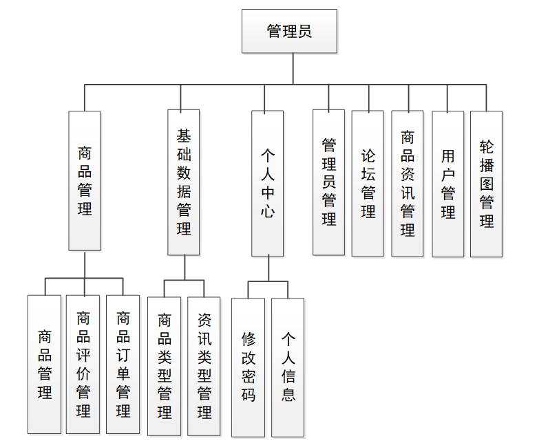

对用户具体功能的设计结果将以如下所示的用户功能结构图来进行体现。用户对于网络海鲜市场系统操作的功能包括在前台购买商品，管理收货地址，管理购买的商品信息，查看商品资讯，管理购物车等。

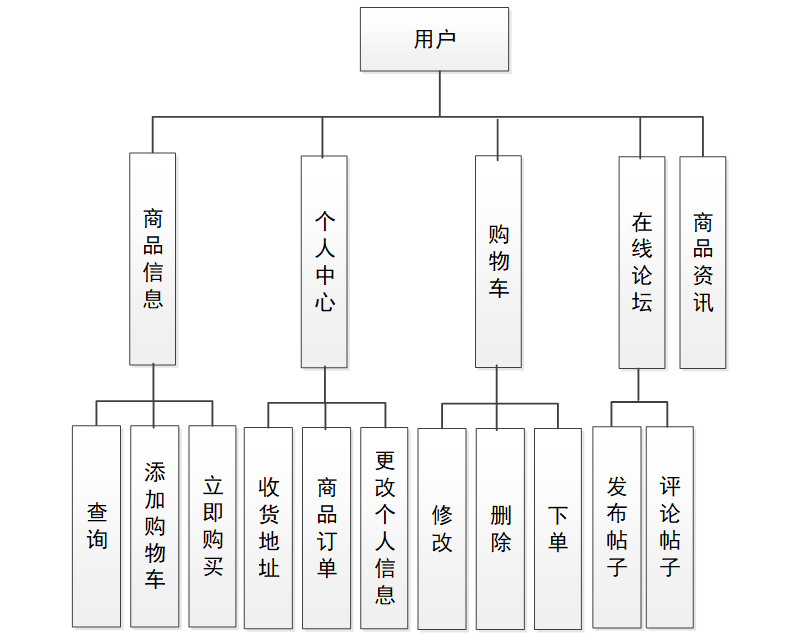

#### 系统流程分析

系统设计不是胡乱的设计，必须符合软件设计思想，具体的流程参考下图。系统设计的前期就是做各种分析，功能的设计，数据库的设计等，等一切都设计好了，逻辑上没有问题，符合设计流程和设计规范，才可以继续编码环节，编码只是实现设计的一个环节而已。

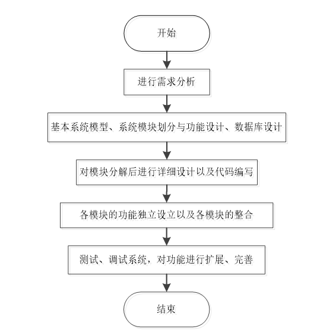

用户是一切应用的基础，只要牵扯到用户，那么肯定需要用户进行注册，只有这样才能让注册的用户进行使用。如果用户没有注册，只能算是游客，那么只能访问一些大众用户可以浏览的信息，如果需要用户操作的部分是不允许访问的，这样能极大的保证用户的权利。用户注册流程用下面的图来表示，主要是先判断用户名，只有用户名能用了才可以进行后面的信息注册。

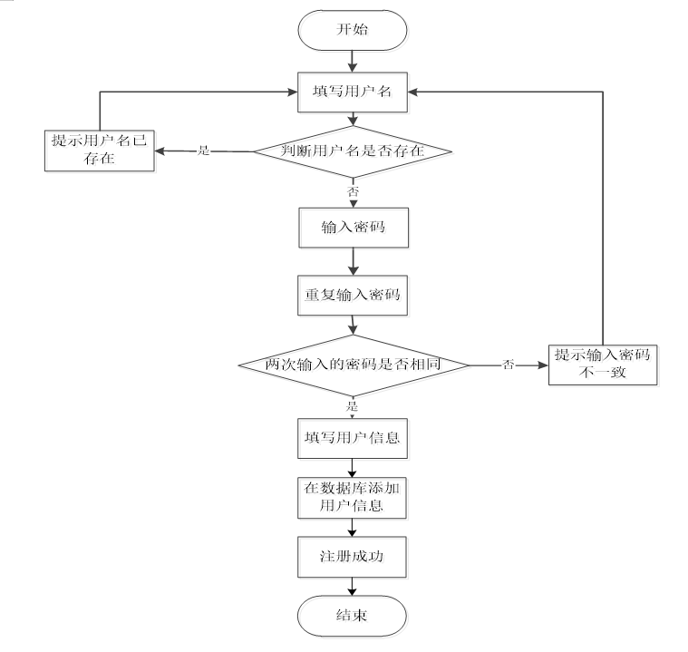

当需要用户登录的时候，肯定是要验证的，只有验证通过的用户才可以进行下一步操作，用户登录成功代表着用户模块的功能对登录用户进行了开放。流程就是如下面的图所示。

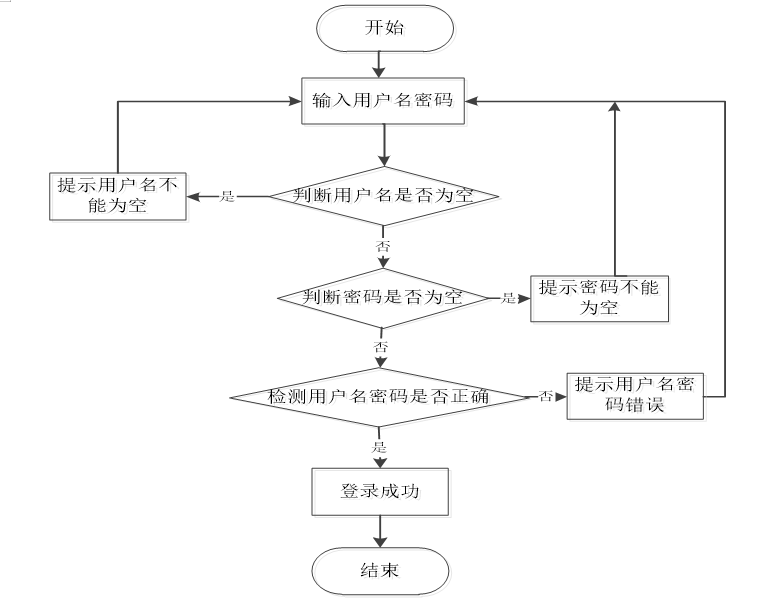

#### 系统作用

网络海鲜市场系统通过信息化手段，实现了海鲜市场的在线化管理和交易。其具体作用如下：

提高管理效率：系统化管理减少了人工操作，提升了市场管理的效率。  
减少错误：自动化处理减少了手工操作的错误率，提高了商品信息和交易记录的准确性。  
提高用户体验：提供了便捷的浏览、购物和资讯获取渠道，提升了用户的购物体验。  
增强市场透明度：通过公开的商品信息和交易记录，提高了市场交易的透明度和可信度。  
促进用户互动：论坛功能增强了用户之间的互动，形成了良好的用户社区，提高了用户黏性。  

#### 系统功能截图

论坛管理

该功能主要用于实现对论坛帖子基本信息的管理，论坛管理界面的运行效果如下。在此界面，管理员不仅需要跟踪论坛帖子，比如查看论坛帖子的回复，删除论坛帖子的回复信息等，修改论坛帖子的内容，删除需要删除的论坛帖子信息等。

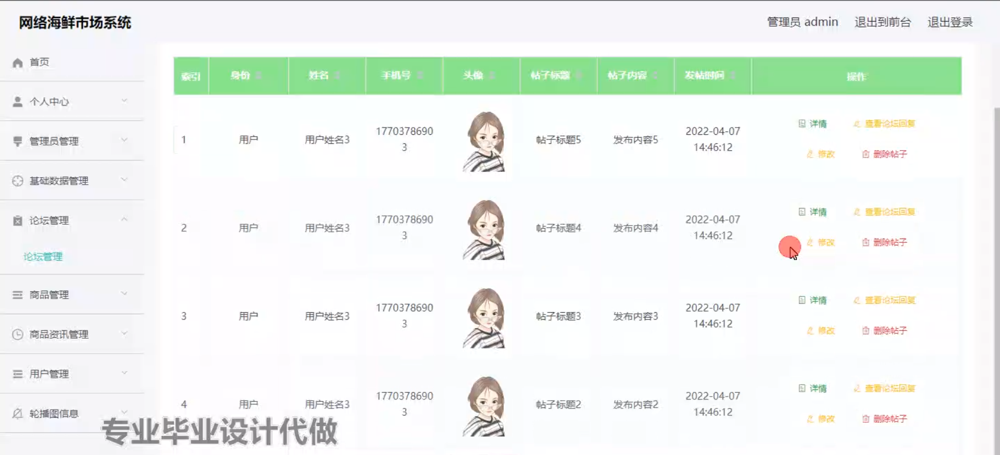

商品管理

该功能主要用于实现对商品信息基本信息的管理，商品管理界面的运行效果如下。在此界面，对商品的类型，商品原价，商品库存，商品名称等信息都需要管理员负责添加和修改，同时还需要对商品的库存进行管理，比如增加商品的库存，或者是对商品库存进行减少以及对销量不好的商品进行下架，对新的商品进行上架等操作。

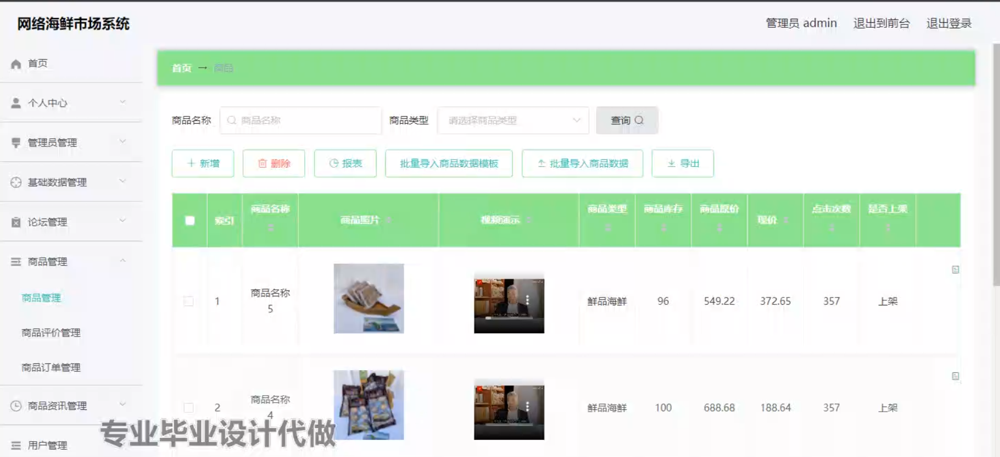

商品评价管理

该功能主要用于实现对商品评价基本信息的管理，商品评价管理界面的运行效果见如下。在此界面，商品的评价内容，以及评价用户和评价的商品等信息都能让管理员查看，同时管理员也能对评价商品的用户进行回复。

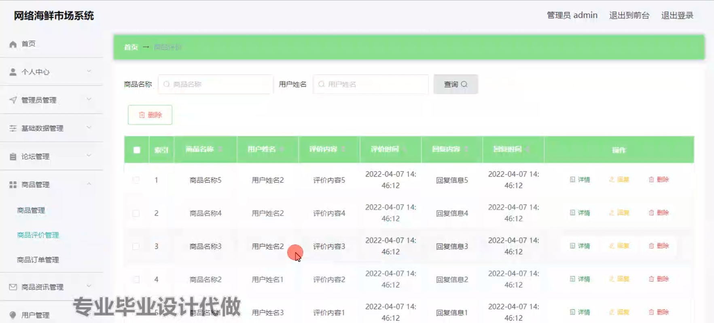

商品订单管理

该功能主要用于实现对商品订单基本信息的管理，商品订单管理界面的运行效果如下。在此界面，管理员主要处理已经销售的商品信息，即商品订单信息，管理员需要对用户刚刚支付的商品订单进行及时发货，以及对各个商品订单的更多的详细信息进行认真查看。

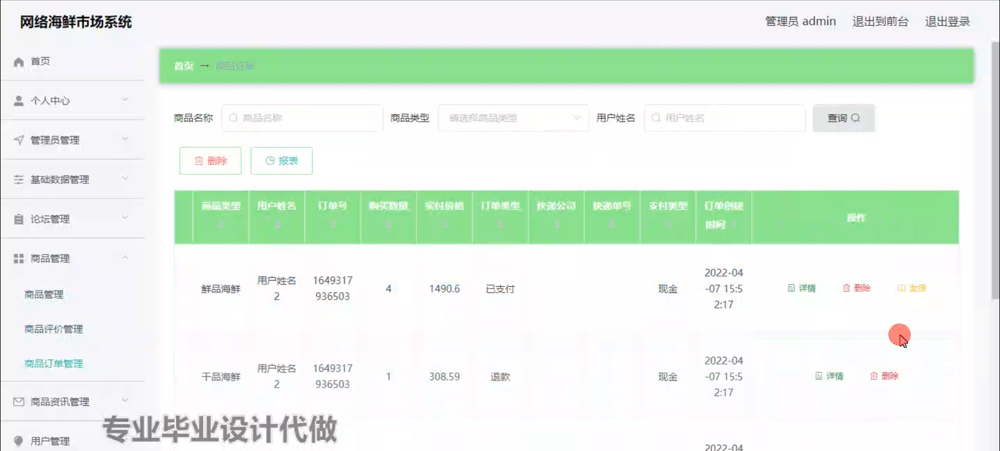

商品资讯管理

该功能主要用于实现对商品资讯基本信息的管理，商品资讯管理界面的运行效果如下。在此界面，商品资讯的内容以及图片等信息都是管理员负责登记的信息，也包括后期对商品资讯信息的针对性修改和删除等都是管理员负责的内容。

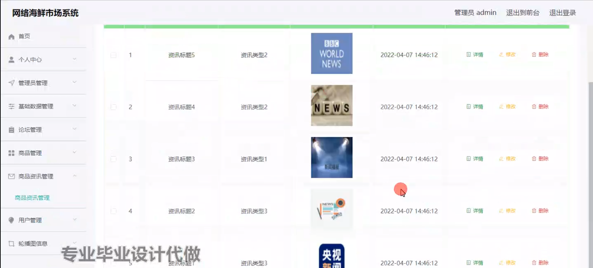

用户功能实现商品信息

商品信息界面的运行效果如下。在此界面，用户可以查看商品信息界面展示的商品相关视频，以及通过对商品的相关介绍信息来了解商品，用户如果有购买的需求，可以通过立即购买功能立即下单。

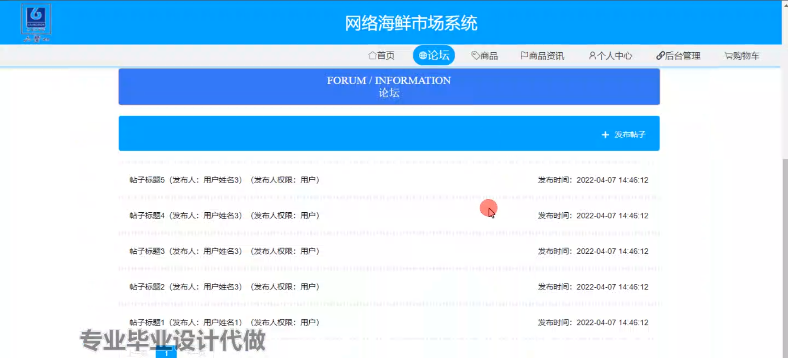

购物车

购物车界面的运行效果如下。在此界面，用户可以统一处理购物车里面的商品信息，比如修改各个商品的购买数量，可以增加购买数量，也能减少购买数量，或者是清理一些不需要购买的商品信息，最后查看支付金额，然后统一下单。

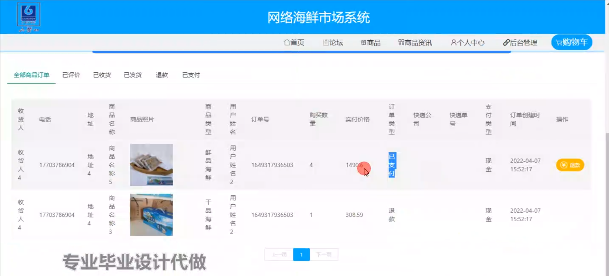

在线论坛

在线论坛界面的运行效果如下。在此界面，用户对在线论坛展示的帖子进行查看，每个论坛帖子都允许用户查看后提交评论信息。在在线论坛的界面，用户点击右上角的发帖链接即可发布自己的帖子。

#### 总结

基于Spring Boot的网络海鲜市场系统在现代电子商务环境中具有重要的应用价值。通过提供全面的功能模块和便捷的操作界面，该系统不仅提升了海鲜市场的管理效率和用户体验，还增强了市场的透明度和可信度。随着信息技术的不断进步，网络海鲜市场系统将进一步推动海鲜市场的数字化和智能化发展，成为海鲜市场管理和交易的有效工具。未来，该系统可以结合更多的智能技术，如大数据分析和人工智能，实现更为精准和高效的市场管理和用户服务。

#### 使用说明

创建数据库，执行数据库脚本 修改jdbc数据库连接参数 下载安装maven依赖jar 启动idea中的springboot项目

前台登录页面
http://localhost:8080/wangluohaixianshicang/front/index.html

后台登录页面
http://localhost:8080/wangluohaixianshicang/admin/dist/index.html

管理员				账户:admin 		密码：admin

用户				账户:a1 		密码：123456
